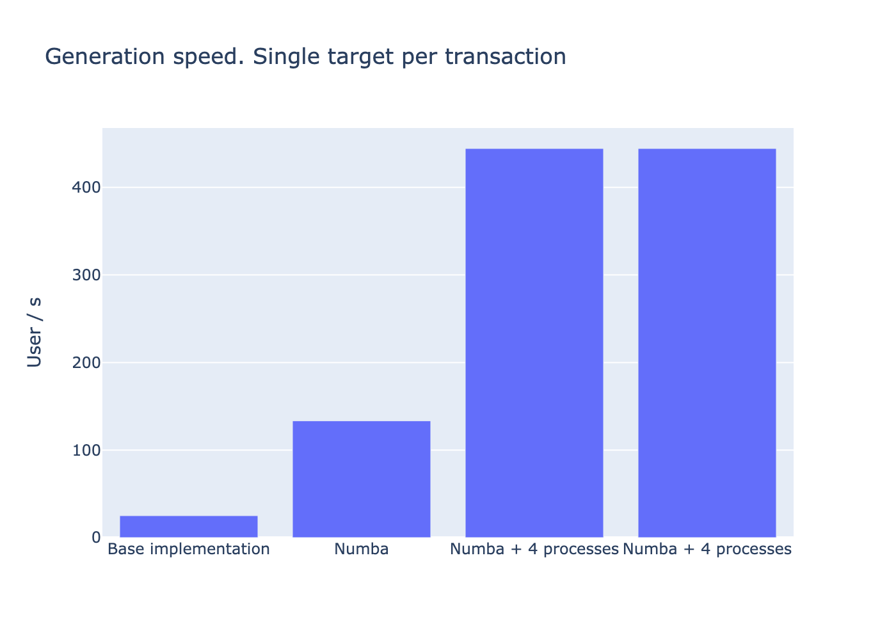

# Skoltech High Performance Python Lab 2024
## Project: Efficient Synthetic Target Generation for Transaction Data
#### Student: Zabolotnyi Artem

📂 [Presentation](presentation/presentation.pdf)

📊 [Profiler output](profiler_results)

### Overview:

This project focuses on improving the speed of synthetic transaction target generation by leveraging Numba and multiprocessing. The optimized implementation achieves a remarkable 18x speedup, increasing performance from 20 users per second to 444 users per second for single-target generation.

Furthermore, the framework now supports **generating 20 synthetic targets per transaction with a performance of 50 users per second**. 




## Performance Metrics for single target per transaction generation

| JIT | Num Process | Num Users | Transactions per User | Num Targets per Transaction | Time (s) | Speedup | User per Sec |
|-----|-------------|-----------|-----------------------|-----------------------------|----------|---------|--------------|
| -   | 0           | 2000      | 4096                  | 1                           | 80       | 1       | 25           |
| +   | 0           | 2000      | 4096                  | 1                           | 15       | 5       | 133          |
| +   | 4           | 2000      | 4096                  | 1                           | 4.5      | 18      | 444          |
| +   | 8           | 2000      | 4096                  | 1                           | 4.5      | 18      | 444          |


# Performance Metrics for 20 targets per transaction generation

| JIT | Num Process | Num Users | Transactions per User | Num Targets per Transaction | Time (s) | Speedup | User per Sec |
|-----|-------------|-----------|-----------------------|-----------------------------|----------|---------|--------------|
| +   | 0           | 2000      | 4096                  | 20                          | 170      | 1       | 12           |
| +   | 4           | 2000      | 4096                  | 20                          | 49       | 3       | 41           |
| +   | 8           | 2000      | 4096                  | 20                          | 41       | 4       | 49           |


Profiling function generate one target per transaction for one user (10x speedup):

**Base implementation:**


**Numba JIT:**


Full profiler example:

**Base implementation:**


**Numba JIT:**


```bash
conda env create --name hppl_project -f environment.yml
conda activate hppl_project
```

**Generate base data**
```
bash scripts/data_generate/data_generate.sh
```

**Time measure and profile base method**
```
bash scripts/data_generate/seq2seq_target_generate.sh

```

**Run single-target profiler**
```
python tests/test_dataset_single_target_profiler.py
```

**Run multi-target profiler**
```
python tests/test_dataset_multi_target_profiler.py
```


**Run profiler visualisation**
```
snakeviz profiler_results/base_target_generation.pstat

snakeviz profiler_results/jit_pytorch_singe_target_load_process_0.pstats
snakeviz profiler_results/jit_pytorch_singe_target_load_process_4.pstats
snakeviz profiler_results/jit_pytorch_singe_target_load_process_8.pstats

snakeviz profiler_results/jit_pytorch_20_targets_load_process_0.pstats
snakeviz profiler_results/jit_pytorch_20_targets_load_process_4.pstats
snakeviz profiler_results/jit_pytorch_20_targets_load_process_8.pstats
```

